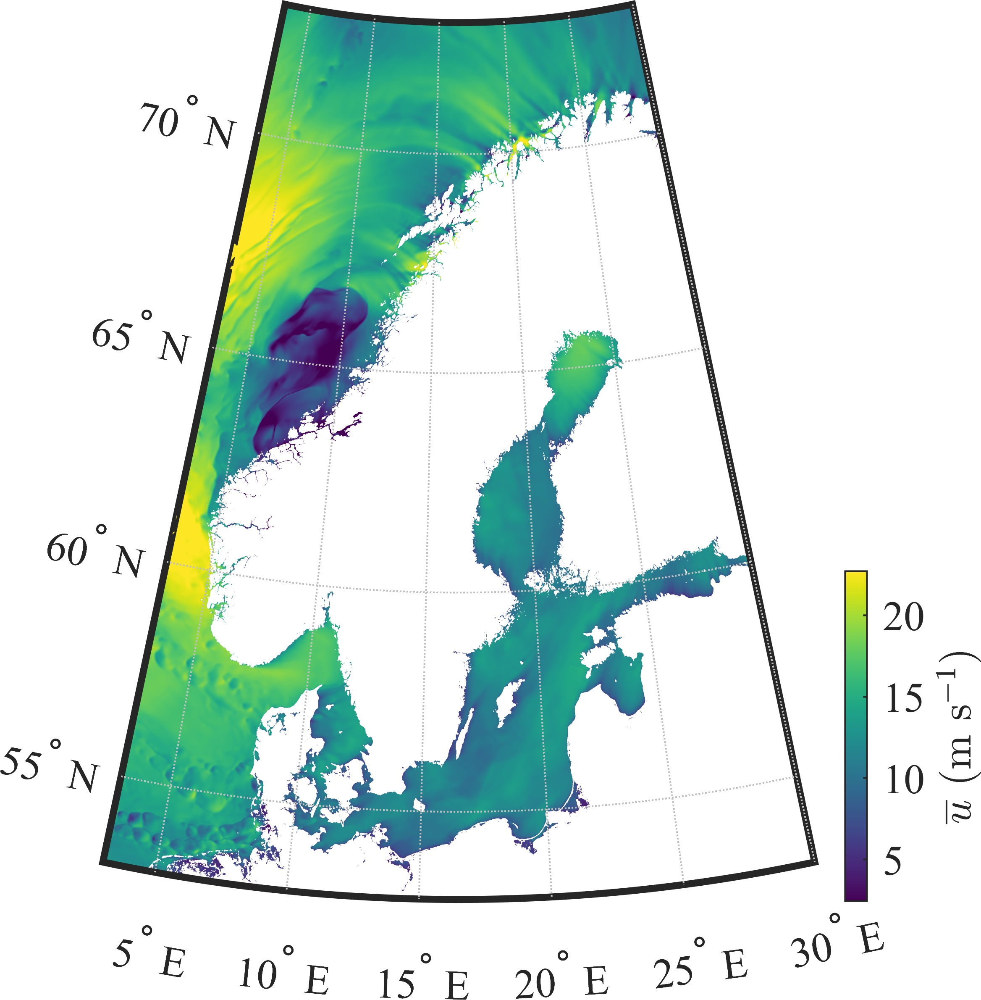
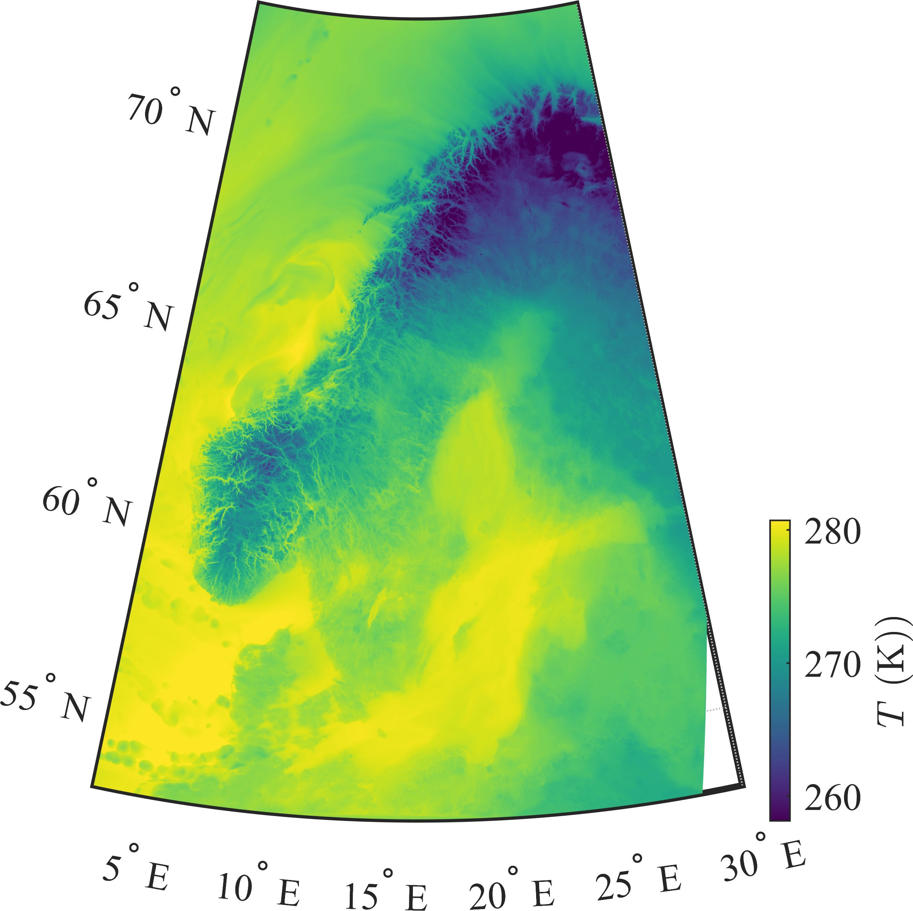
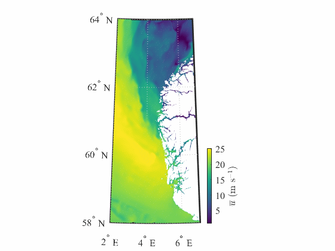

# Exploring the MetCoOp-Ensemble Prediction System data

Automated and remote data extraction of MetCoOp-Ensemble Prediction System data

## Example 1 (Storam Aina in Scandinavia) 

The fitting of the extended SEIR model to real data provides the following results:

## Example 2 (Temperature Map) 

The fitting of the extended SEIR model to real data provides the following results:

## Example 3 (Animation of storm Aina. from 1 am to 3 pm on 08-12-2017) 

